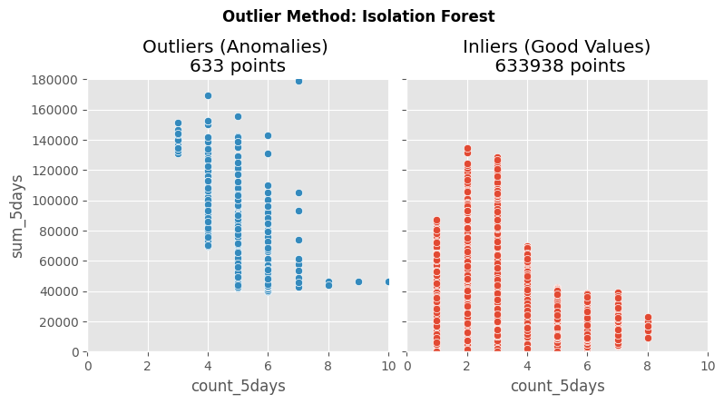
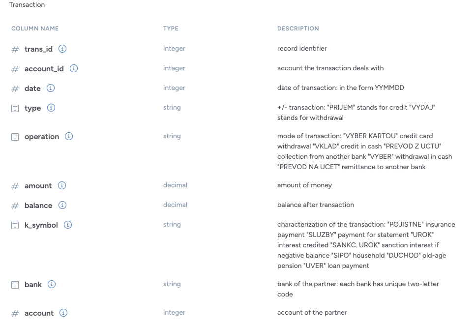

# Machine Learning Bank Fraud Detection

<p>
  
</p>

[img source: Fraud Detection Software for Banks | SQN Banking Systems](https://sqnbankingsystems.com/blog/fraud-detection-software-for-banks/)

## Project Description

This project was inspired by the [How to apply Unsupervised Anomaly Detection on bank transactions](https://www.justintodata.com/unsupervised-anomaly-detection-on-bank-transactions-outliers/) article from authors of https://www.justintodata.com as the inspiration for this project.

Anti-Money Laundering (AML) and fraud analytics require one to consider several factors when building production based systems.

We have to consider the **limitations of the financial institution**. For example, how up to date are the systems of the institution as it is important to understand will new technology be needed to handle all of the possible feature information that machine learning (ML) models can capture and can the current systems handle real-time decision making.

**Balancing customer experiences with bank losses**. Like medical doctors, we should do no harm. Alerts generated from ML models should not impact legit customers too much. At best, inconveniences should inspire a sense of confidence that the institution is looking out for the well-being of its customers. It is standard that banks and financial institutions will have to take on some losses, but tools should help identify the line between customer annoyance and mitigating business losses.

Lastly, **understand the operation teams capacity**. While, the ML system can send anomalous transactions to agents for follow-up for further investigation and support. A priortization scheme may need to be implemented first to optimize mitigating large accounts and larger losses first. An unfortunate consequence, is that small, infrequent irregular cases may not get investigated because they do not meet largeness thresholds.

### The Problem

This project looks at detecting bank fraud by identifying outliers or anomalies from unlabeled bank transactions. Unlabeled refers to the fact, that data does not posses any prior sort of pre-existing markers that a transaction is fraudulent or not. It focuses on creating a ML model to identify the anomolous events (i.e., labeling transactions as anomalous/fradulent or not), which would then be sent to operation and support teams for futher investigation. It presents a method for anomaly detection using `Isolation Forests`.

#### Why Isolation Forest?

According to [Wikipedia](https://en.wikipedia.org/wiki/Isolation_forest):

The Isolation Forest (iForest) algorithm took advantage of the attributes of anomalies being “few and different”, they are easier to “isolate” compared to normal points. So instead of trying to build a model of normal instances, it explicitly isolates anomalous points in the dataset.

The main advantage of this approach is the possibility of exploiting sampling techniques to an extent that is not allowed to the profile-based methods, creating a very fast algorithm with a low memory demand.

Isolation Forest is an efficient and simple algorithm used for anomaly detection which makes it a popular choice in industries like cybersecurity, finance and healthcare. It identifies outliers in large datasets by isolating them through binary partitioning which requires minimal computational overhead. This ability to quickly finding anomalies is important in applications where detecting unusual patterns is key to safeguarding against risks or identifying hidden insights.

Key concepts that define Isolation Forest:

- `Isolation:` The algorithm isolates anomalies by focusing on their differences from normal data points rather than their similarities. Anomalies are typically rare and distinct from the majority helps in making them easier to isolate.

- `Partitioning:` Data is split by randomly selecting features and using random values to partition the data. This helps in efficiently isolating anomalies from normal data.

- `Anomaly Score:` It measures how easily a data point can be isolated. Points that require fewer splits to isolate are considered anomalies and assigned higher scores.

### What this Project Does Specifically

The project:

- Loads and inspects the bank data
- Preprocesses/cleans the data
- Cluster the data using an unsupervised learning algorithm: [Isolation Forest](https://en.wikipedia.org/wiki/Isolation_forest)
- Identify anomalies and outliers
- Visualizes results using Seaborn

### The Project Results

The Isolation Forest Model reveals bank transaction anomalies from normal transactions as shown in the figure below.

<p>
  
</p>

The anomalous transactions would be subsequently be examined by support and operation teams for a production level system prior to consultation with bank customers.

The project reveals how the ML detection mechanism would be a starting point for mitigating and eventually preventing bank fraud based on unsupervised data.

---

## Objective

The project contains the key elements:

- `FacetGrid` seaborn figure type for visualization,
- `Git` (version control),
- `Isolation Forest` algorithm for anomaly detection,
- `Jupyter` Python coded notebooks,
- `Numpy` for arrays and numerical operations,
- `Pandas` for dataframe usage,
- `Python` the standard modules,
- `Scikit-Learn` to get training and test datasets,
- `Seaborn` for visualizations
- `uv` package management including use of `ruff` for linting and formatting

## Tech Stack


---

## Getting Started

Here are some instructions to help you set up this project locally.

---

## Installation Steps

- The Python version used for this project is `Python 3.12` to be compatible with some of the other packages,

### Clone the Repo

1. Clone the repo (or download it as a zip file):

   ```bash
   git clone https://github.com/beenlanced/ml_bank_fraud_detection.git
   ```

2. Create a virtual environment named `.venv` using `uv` Python version 3.12:

   ```bash
   uv venv --python=3.12
   ```

3. Activate the virtual environment: `.venv`

   On macOs and Linux:

   ```bash
   source .venv/bin/activate #mac
   ```

   On Windows:

   ```bash
    # In cmd.exe
    venv\Scripts\activate.bat
   ```

4. Install packages using `pyproject.toml` or (see special notes section)

   ```bash
   uv pip install -r pyproject.toml
   ```

### Running the Codeded Examples

1. **Run the Python Coded Jupyter Notebooks**

---

## Data Set

[1999 Czech Financial Data Set - Real Anonymized Transactions](https://data.world/lpetrocelli/czech-financial-dataset-real-anonymized-transactions) using the transaction csv file.

Attribute description of the data set:

<p>
  
</p>

---

### Final Words

Thanks for visiting.

Give the project a star (⭐) if you liked it or if it was helpful to you!

You've `beenlanced`! 😉

---

## Acknowledgements

I would like to extend my gratitude to all the individuals and organizations who helped in the development and success of this project. Your support, whether through contributions, inspiration, or encouragement, have been invaluable. Thank you.

Specifically, I would like to acknowledge:

- [How to handle Imbalanced Data in machine learning classification](https://www.justintodata.com/imbalanced-data-machine-learning-classification/) from authors of https://www.justintodata.com as the inspiration for this project.

- A pretty handy tutorial on [Isolation Forest for Outlier Detection with Python](https://www.youtube.com/watch?v=O9VvmWj-JAk)

- [Hema Kalyan Murapaka](https://www.linkedin.com/in/hemakalyan) and [Benito Martin](https://martindatasol.com/blog) for sharing their README.md templates upon which I have derived my README.md.

---

## License

This project is licensed under the MIT License - see the [LICENSE](./LICENSE) file for details
